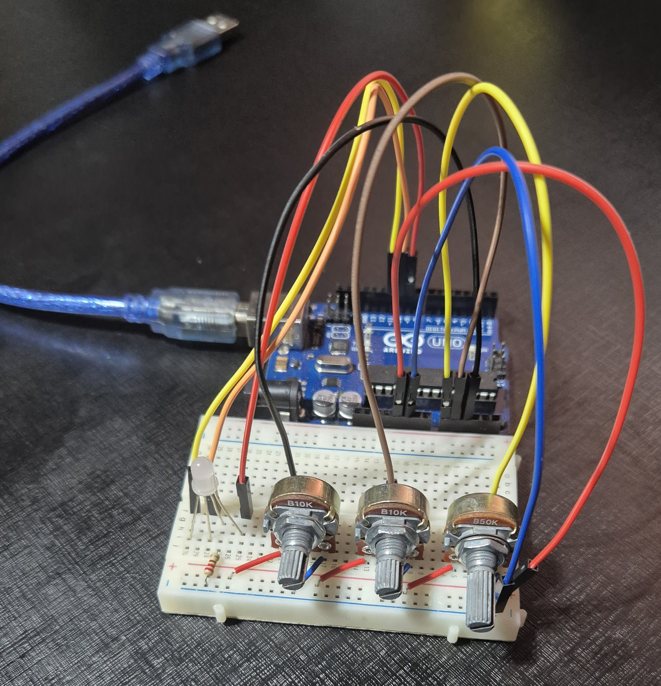
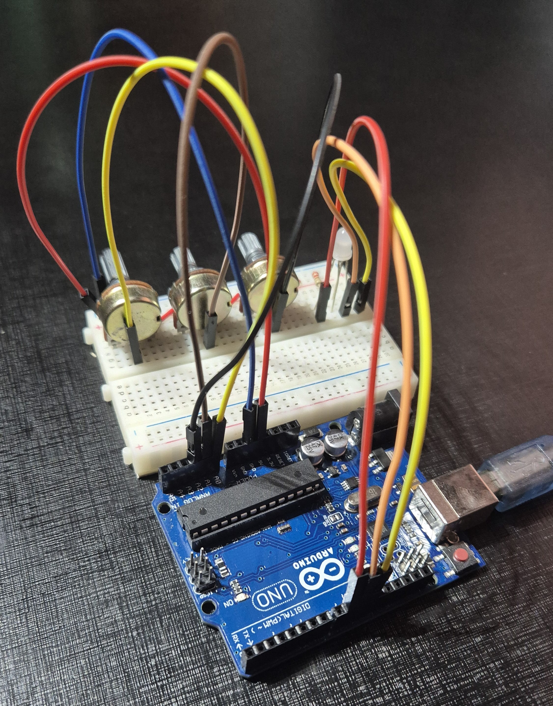
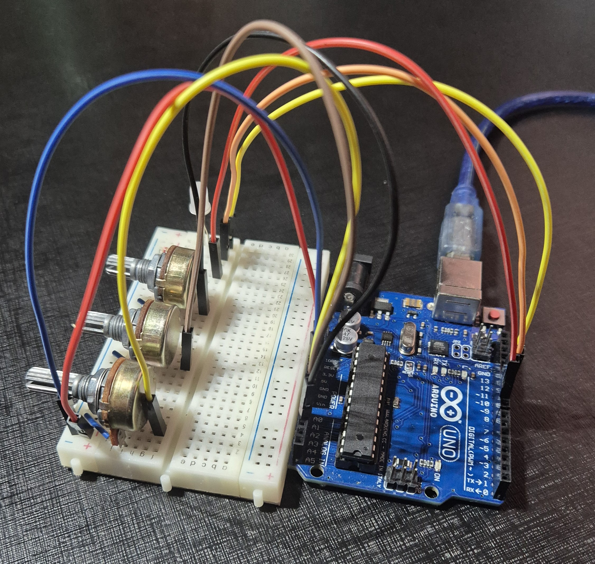

# RGB Calibrator

Um projeto para calibrar LEDs RGB usando Arduino.

## Descrição

Este projeto permite calibrar LEDs RGB para obter a cor desejada com precisão. Utiliza um Arduino e potenciômetros para fazer o ajuste fino das cores e obter a tensão a leitura analógica e a leitura PWM da intensidade de cada conetor do led RGB.

## Protótipo





## Componentes Necessários

- Arduino Uno
- LED RGB
- 1 Resistor (220Ω)
- Protoboard
- Cabos Jumper
- 3 potenciômetros B10K

## Instalação

1. Clone este repositório:
    ```bash
    git clone https://github.com/seu-usuario/RGB-Calibrator.git
    ```
2. Abra o projeto no Arduino IDE.
3. Carregue o código no seu Arduino.

## Uso

1. Conecte os componentes conforme o diagrama.
2. Abra o monitor serial no Arduino IDE.
3. Calibre através do potenciômetro e veja a saída no monitor serial.

## Contribuição

1. Faça um fork do projeto.
2. Crie uma nova branch:
    ```bash
    git checkout -b minha-nova-feature
    ```
3. Faça suas alterações e commit:
    ```bash
    git commit -m 'Adiciona nova feature'
    ```
4. Envie para o branch original:
    ```bash
    git push origin minha-nova-feature
    ```
5. Crie um Pull Request.

## Licença

Este projeto não possui restrição de licenciamento.
